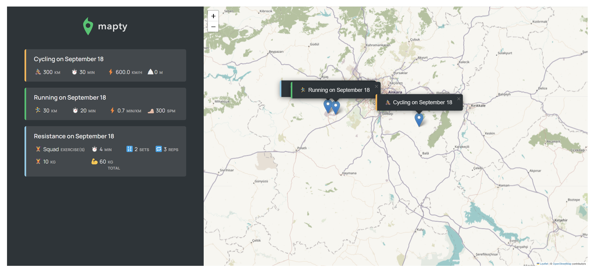

---

# **Mapty - Workout Tracking Map Application**

**Mapty** is a simple and effective web application for tracking outdoor workouts like running and cycling. It utilizes an interactive map for logging workouts, making it easy to visualize your fitness journey.

## **Live Demo**

Check out the live demo of Mapty here:  
[**Mapty Live Demo**](https://66ea39bd35bcb9d9088d01ea--steady-fairy-290c28.netlify.app/)

## **Features**

- **Interactive Map**: Log your workout locations directly on the map.
- **Multiple Workout Types**: Supports running, cycling, and more.
- **Custom Workout Details**: Add workout details like distance, duration, and type.
- **Map Visualization**: Workouts are displayed as markers on the map.
- **Workout List**: See all workouts in a detailed list.
- **Persistent Storage**: Workouts are saved in the browser’s local storage for future use.

##User Interface
Here's a preview of how the Mapty app looks in action:



## **How to Use**

1. **Access the Application**
   - Open Mapty in your web browser.
   - The app will automatically load an interactive map.

2. **Add a New Workout**
   - Click on the map at the location where you completed your workout.
   - Fill out the workout form that appears, entering details like type, distance, and duration.
   - Press **Enter** or click **Submit** to save the workout.

3. **View Your Workouts**
   - All saved workouts will be listed on the left side of the screen.
   - Click any workout from the list to view its location on the map.

4. **Explore the Map**
   - Use the zoom controls to view your workout routes in detail.
   - Click and drag to navigate around the map.

## **Technical Overview**

- **Tech Stack**: HTML, CSS, JavaScript.
- **Map Integration**: Powered by [Leaflet.js](https://leafletjs.com/).
- **Geocoding**: Utilizes a geocoding API to convert workout locations to map markers.
- **Data Storage**: Uses the browser's local storage for storing workout data, ensuring persistence across sessions.

License
This was a learning project for a portfolio project! You can not claim it as your own or use it to teach. @copyright @jonasschmedtmann

## **Project Setup**

To run this project locally:

1. Clone the repository:

   ```bash
   git clone https://github.com/yourusername/mapty.git
   ```

2. Navigate to the project directory:

   ```bash
   cd mapty
   ```

3. Open `index.html` in your browser to start the application.
---
